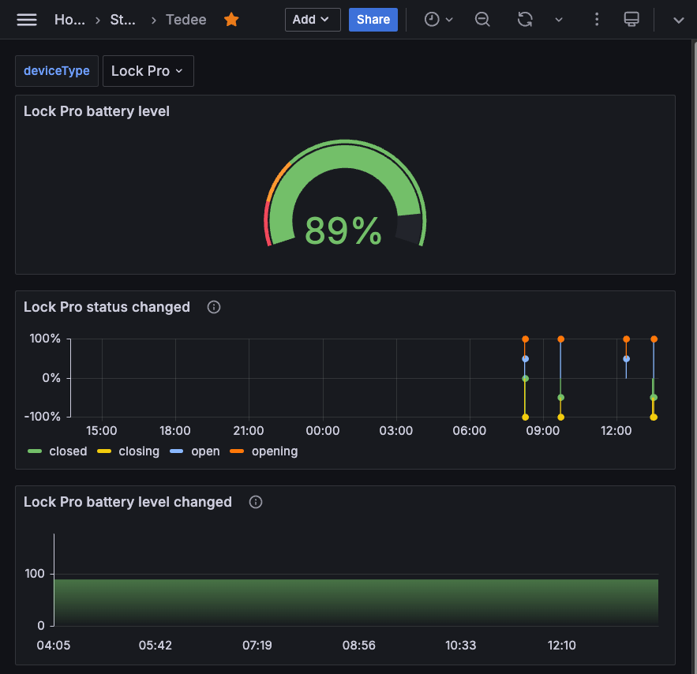

I'm big fun of [Tedee](https://tedee.com/) devices.
This is a simple PHP callback to manage Tedee Webhook notifications by collecting Prometheus metrics.

## Requirements
- Tedee Smart Lock
- [Tedee Bridge](https://tedee.com/product-info/tedee-bridge/)
- Web server
- PHP > 8

## Installation
- Register you webhook callback via [Tedee Bridge API](https://docs.tedee.com/bridge-api) 
- Clone this repo into registered path
- Run `composer install`

## Grafana
Example of Grafana dashbord for metrics collected:

